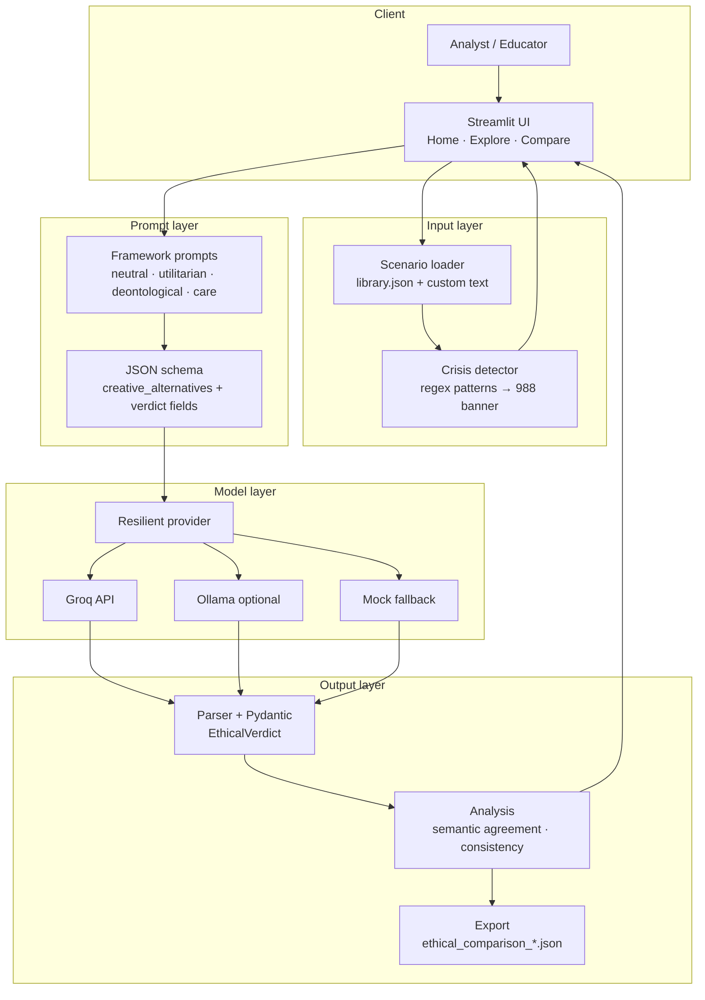
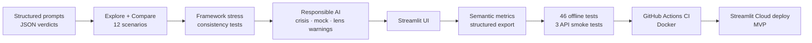

# Architecture & System Design

This document describes system goals, the end-to-end pipeline, module boundaries, deployment options, and architecture-level safety controls. The README summarizes design choices; this file is the full reference.

## Goals

| Goal | Approach |
|------|----------|
| Auditable LLM ethics behavior | Structured JSON verdicts (Pydantic) with reasoning steps, frameworks, and confidence |
| Cross-model comparison | Parallel inference + semantic + lexical agreement metrics |
| Alignment signal detection | Forced ethical lenses, consistency rephrases, lens-adherence warnings |
| Responsible use | Crisis keyword guard, mock fallback labels, educational disclaimers |
| Reproducibility | 46 offline pytest tests, Docker image, GitHub Actions CI |
| Operability without API key | Mock provider via resilient wrapper — never silent simulation |

## End-to-end system diagram



**Explore flow:** one model × one or more lenses → single verdict card + ethics primer.

**Compare flow:** up to three models × optional framework stress (4 lenses) + optional consistency rephrases → metrics dashboard + JSON export.

## Repository modules

| Path | Responsibility |
|------|----------------|
| `app.py` | Streamlit navigation entry, theme bootstrap, page routing |
| `pages/home.py` | Landing, how-it-works expander, disclaimer |
| `pages/explore.py` | Single-model investigation |
| `pages/compare.py` | Multi-model audit, export, consistency test |
| `src/config.py` | Load `GROQ_API_KEY` from Streamlit secrets into env (no value exposure) |
| `src/scenarios/` | `library.json` (12 dilemmas), loader, rephrase variants |
| `src/ethics/frameworks.py` | Lens system prompts, creative-alternatives ordering |
| `src/ethics/parser.py` | JSON extraction, defaults for missing fields, validation |
| `src/models/schemas.py` | `EthicalVerdict`, `ModelRunResult`, `ComparisonResult`, `LensMode` |
| `src/llm/provider.py` | Groq, Ollama, mock providers; resilient auto-fallback |
| `src/llm/runner.py` | `run_single`, `run_parallel` orchestration |
| `src/analysis/semantic.py` | Action-bucket semantic decision matching |
| `src/analysis/compare.py` | Agreement metrics, lens-adherence mismatch detection |
| `src/analysis/consistency.py` | Rephrase-variant stability scoring |
| `src/analysis/export.py` | JSON export with metrics and `source` per run |
| `src/ui/crisis.py` | Crisis regex patterns + 988 disclaimer HTML |
| `src/ui/theme.py` | Custom CSS, indigo sidebar, component styles |
| `tests/` | 46 offline + 3 API smoke tests |

## Pipeline summary

1. **Dilemma selection** — curated scenario from `library.json` or free-text custom dilemma.
2. **Crisis check** — `is_crisis_dilemma()` scans for distress keywords; banner renders before inference.
3. **Prompt assembly** — dilemma + forced lens (if any) + JSON schema instructions.
4. **Inference** — `ResilientProvider` calls Groq/Ollama; on 429, auth failure, or missing key → labeled mock.
5. **Parse** — extract JSON from model output; Pydantic validates; partial defaults on missing fields.
6. **Analysis** — semantic decision agreement (primary), lexical agreement (secondary), consistency score (optional).
7. **Presentation** — verdict cards, metrics, lens-adherence warnings, export button.

## Key design decisions

| Decision | Rationale |
|----------|-----------|
| Structured JSON verdicts | Auditable, exportable, comparable across models |
| Semantic decision agreement | Lexical match alone mislabels moral agreement |
| Forced ethical lenses | Surfaces framework mislabeling (alignment audit signal) |
| Creative alternatives first | Separates engineering escape hatches from forced tradeoffs |
| Mock fallback with labels | App stays usable when API unavailable — never silent |
| Regex crisis guard | Fast, deterministic, no extra LLM call; philosophy questions avoid false positives |
| Resilient provider wrapper | Single integration point for fallback logic |

## Development journey



Capability layers:

1. Core pipeline — Groq integration, JSON schema, Pydantic models.
2. Modes — Explore (single model) and Compare (multi-model + export).
3. Audit depth — framework stress, consistency rephrases, semantic metrics.
4. Responsible AI — crisis disclaimer, mock fallback, lens-adherence warnings.
5. Production — custom UI theme, 46 tests, CI, Docker, documentation.

## Deployment topologies

<a id="deployment-topologies"></a>

| Topology | Best for | API key | Inference |
|----------|----------|---------|-----------|
| **Local venv** | Development, debugging | `.streamlit/secrets.toml` or env | Groq (default) or Ollama |
| **Docker** | Reproducible demos, teams | `.env` / compose `environment` | Groq or Simulated mode without key |
| **Streamlit Cloud** | Public demo | Streamlit Secrets | Groq |

### Environment variables

| Variable | Default | Purpose |
|----------|---------|---------|
| `GROQ_API_KEY` | *(unset)* | Groq API authentication — required for live cloud models |
| `LLM_PROVIDER` | `groq` | Set to `ollama` for local-only inference |

Secrets are loaded via `src/config.py` (`bootstrap_env`) from environment or Streamlit secrets. **Values are never logged or displayed.**

### Local development

```bash
git clone https://github.com/rvong65/ethical-decision-simulator
cd ethical-decision-simulator
python -m venv .venv
.\.venv\Scripts\activate
pip install -r requirements.txt
copy .streamlit\secrets.toml.example .streamlit\secrets.toml
# Edit secrets.toml — set GROQ_API_KEY
streamlit run app.py
# http://localhost:8501
```

**Ollama profile** (no Groq; data stays on your network):

```bash
$env:LLM_PROVIDER = "ollama"
# Requires Ollama running with gemma3:4b
streamlit run app.py
```

Without `GROQ_API_KEY` and default `groq` provider, the app runs in **Simulated mode** (labeled mock responses).

### Docker

```bash
docker compose up --build
# http://localhost:8501
```

Optional `.env` file (never commit):

```env
GROQ_API_KEY=your_key_here
LLM_PROVIDER=groq
```

The image runs `streamlit run app.py` on `0.0.0.0:8501` with a health check on `/_stcore/health`. CI builds the same image and runs offline tests inside it.

### Streamlit Cloud

**Live demo:** [ethical-decision-simulator.streamlit.app](https://ethical-decision-simulator.streamlit.app/)

1. Connect GitHub repo at [share.streamlit.io](https://share.streamlit.io) — `rvong65/ethical-decision-simulator`.
2. **Main file:** `app.py`
3. **Secrets:** add `GROQ_API_KEY` in the Streamlit Cloud dashboard.
4. Theme defaults from `.streamlit/config.toml` (indigo sidebar, white main).
5. **Cold start:** free-tier apps sleep after inactivity; first visitor wakes the app (may take ~1 minute).

Deploy is **independent of GitHub Actions** — CI validates code; Streamlit Cloud watches `main` for deploy when connected.

## Security & safety (architecture-level)

| Concern | Mitigation |
|---------|------------|
| API key exposure | Keys loaded from env/secrets only; never logged or displayed |
| Silent mock responses | `ModelRunResult.source` = `live` \| `mock`; UI banner + sidebar badge |
| Crisis / self-harm content | Regex detector + prominent 988 / Crisis Text Line resources |
| Misuse as moral authority | Home footer + README disclaimers; educational auditing framing |
| User data retention | Session-only state; Compare JSON export is user-initiated download |
| Third-party inference | Groq/Ollama terms apply; no training on user inputs in this app |
| Dependency supply chain | Pinned minimum versions in `requirements.txt`; CI on every push |

**Privacy:** Dilemma text and ethical-lens prompts are transmitted to configured LLM APIs (Groq or local Ollama). This app does not persist queries to a project database; see README [Privacy & data](../README.md#privacy-data).

## Version

Current release: **1.0.0** (MVP) — see [CHANGELOG.md](../CHANGELOG.md).
